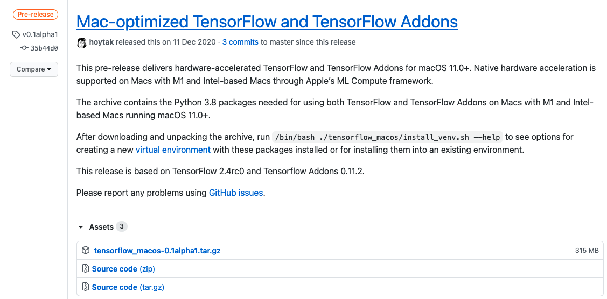
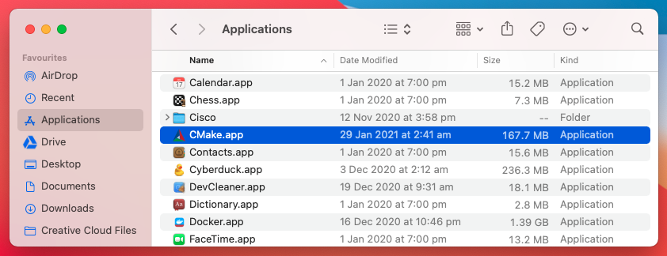
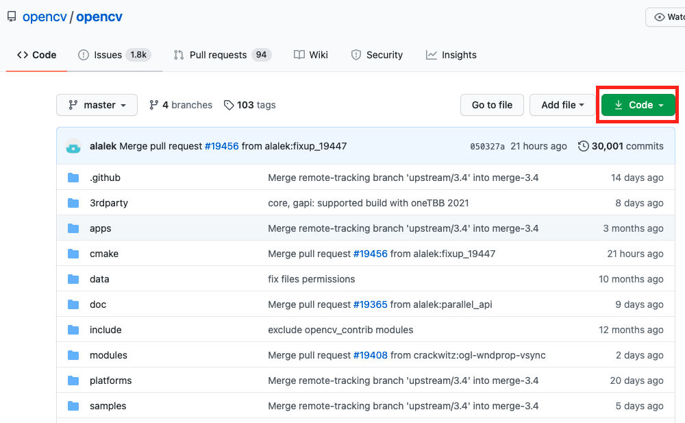
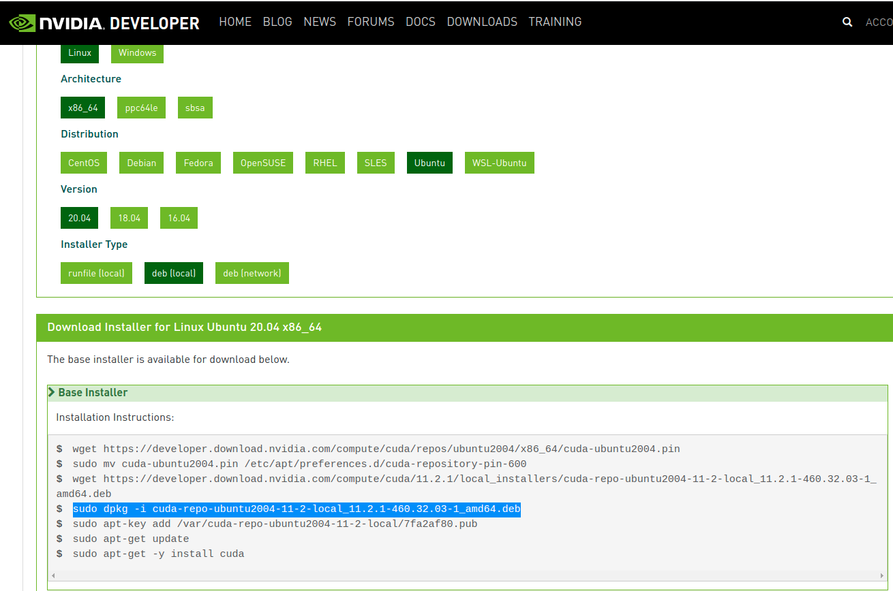
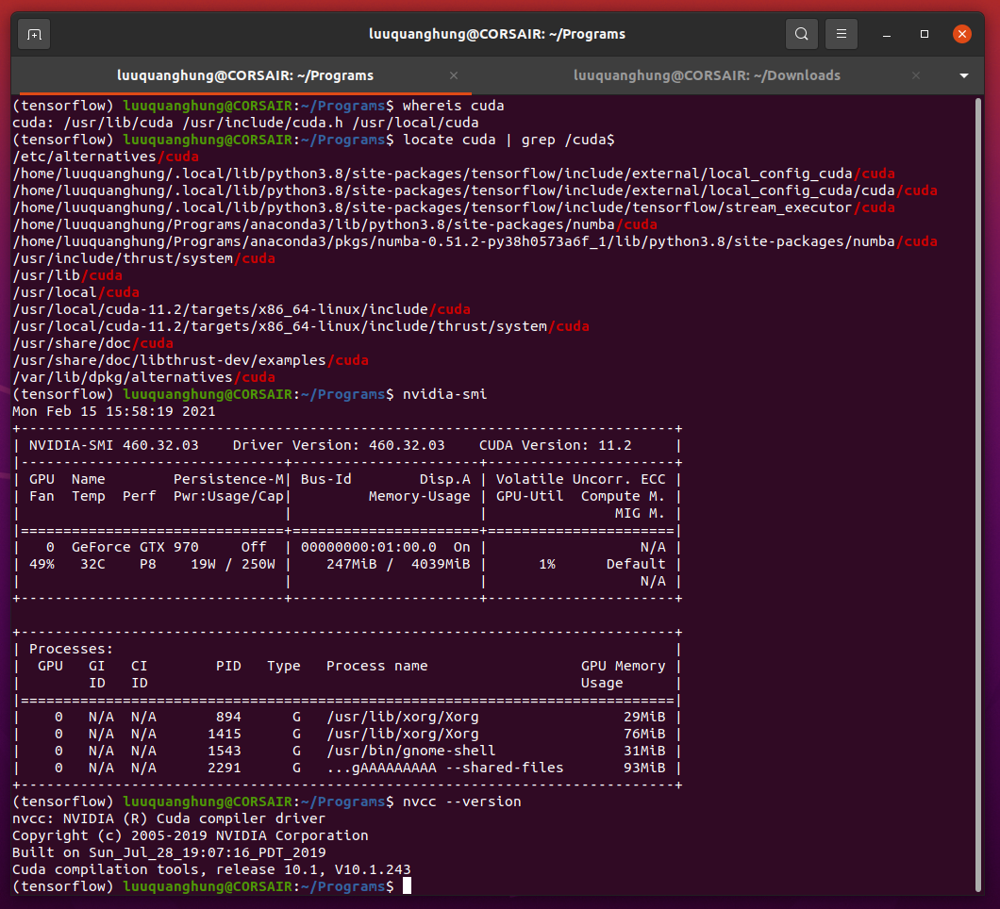

# Hung Q. Luu
Some useful tips.

---

## Apple silicon Mac

Apple silicon-based products released in the end of 2020 are the game-changer. Mac computers with Apple silicon can run much faster than the Intel-based competitors for the same configuration. More interestingly, you can use your Mac for data science and machine learning tasks. I have configured my Mac Mini M1 to run deep learning tasks as follows.

### Install Tensorflow on Mac M1

Apple did release a hardware-accelerated TensorFlow and TensorFlow Addons for macOS 11.0+, which supports Tensorflow r2.4rc0 and TensorFlow Addons 0.11.2. It requires Python 3.8 which can be installed via [XCode Command Line Tool](https://developer.apple.com/download/more/?=command%20line%20tools) (you need an Apple Developer account to install XCode). Please check out the nice instruction of [Fabrice Daniel](https://towardsdatascience.com/tensorflow-2-4-on-apple-silicon-m1-installation-under-conda-environment-ba6de962b3b8).

**Step 1: Setup conda environment.** 

You need to install miniconda such as *miniforge* first. Once done, move forward to create a conda environment, for instance *appletf*:
```
conda create --name appletf
```
Now activate it in Terminal window with
```
conda activate appletf
```
Continue to install Python and its main libraries. Note that *numpy* and *keras* will be installed later along with the deployment of Tensorflow. 
```
conda install -y python==3.8.6
conda install -y pandas
conda install -y matplotlib
conda install -y scikit-learn
conda install -y jupyterlab
```

**Step 2: Install Tensorflow** 

Grab the most recent Tensorflow version from Apple team in GitHub:
[https://github.com/apple/tensorflow_macos/releases](https://github.com/apple/tensorflow_macos/releases). 

Unfold Assets tab  and select the complete version [tensorflow_macos-0.1alpha2.tar.gz](https://github.com/apple/tensorflow_macos/releases/download/v0.1alpha2/tensorflow_macos-0.1alpha2.tar.gz). Unzip it to your download folder. The key thing is do not run the default installation given by Apple. It does not work as in my case. Note that *pip* should be installed before the following sub-steps as well.

Change directory to this folder
```
cd tensorflow_macos/arm64
```
First, we install numpy and other Tensorflow add-on
```
pip install --upgrade --no-dependencies --force numpy-1.18.5-cp38-cp38-macosx_11_0_arm64.whl grpcio-1.33.2-cp38-cp38-macosx_11_0_arm64.whl h5py-2.10.0-cp38-cp38-macosx_11_0_arm64.whl tensorflow_addons-0.11.2+mlcompute-cp38-cp38-macosx_11_0_arm64.whl
```
Then install additional packages
```
pip install absl-py astunparse flatbuffers gast google_pasta keras_preprocessing opt_einsum protobuf tensorflow_estimator termcolor typing_extensions wrapt wheel tensorboard typeguard
```
Finall install all TensorFlow package by Apple manually
```
pip install --upgrade --force --no-dependencies tensorflow_macos-0.1a1-cp38-cp38-macosx_11_0_arm64.whl
```

### Install OpenCV and Darknet

OpenCV is a well-known library for computer vision orginally developed by Intel. We will build OpenCV in your Mac from scratch. Darknet is an open source neural network framework written in C/C++ and CUDA, which contains the state-of-the-art real-time object detection system, so-called YOLO. We will install both of them here.

**Step 1: Install cmake** 
*cmake* is the tool that allow you to build OpenCV in your Mac. First, grab a Mac-based version from [cmake homepage](https://cmake.org/download/). Better to use the *unversal cmake version 3.19.4*  for Mac OS X 10.13 or later from [this link](https://github.com/Kitware/CMake/releases/download/v3.19.4/cmake-3.19.4-macos-universal.dmg)

After openning, drag and drop the file into Applications folder  of your Mac.

To need to config *cmake* so that later on we can use it from the command line.
sudo "/Applications/CMake.app/Contents/bin/cmake-gui" --install

**Step 2: Install Darknet** 

Install darknet is simple and straightforward by [Joseph Redmon](https://pjreddie.com/darknet/install/). You can download it directly it GitHub or clone using [Git](https://git-scm.com/download/mac). 
```
git clone https://github.com/pjreddie/darknet.git
cd darknet
make
```
Make sure that you compile (*make*) it in the folder that you want to run *darknet* in the future. For example I put it in the folder
```
/Users/YOURNAME/opt/darknet/
```
After compilation
```
./darknet
```
you will be succesful if you see something like
```
usage: ./darknet <function>

```

**Step 3: Build OpenCV** 

First, we download the latest version of OpenCV (4.5.1) in GitHub  to your Mac, either directly or using git. We need both OpenCV [main packages](https://github.com/opencv/opencv/) and their [extra modules](https://github.com/opencv/opencv_contrib). Unzip both folders, so that you now having two folders after decompression
```
opencv-main
opencv_contrib-main
```
Now assume you want to allow *darknet* to use *OpenCV* later, you should configure the path such as
```
/Users/YOURNAME/opt/darknet/opencv/opencv_contrib-master/modules
```
You should also to point to the python compiler correctly in the *appletf* conda environment setup earlier.
```
/Users/YOURNAME/opt/miniforge/envs/appletf/bin/python3
```
If you are happy with both paths, modify the following statements to include both of them
```
arch -arm64 cmake \
  -DCMAKE_SYSTEM_PROCESSOR=arm64 \
  -DCMAKE_OSX_ARCHITECTURES=arm64 \
  -DWITH_OPENJPEG=OFF \
  -DWITH_IPP=OFF \
  -D CMAKE_BUILD_TYPE=RELEASE \
  -D CMAKE_INSTALL_PREFIX=/usr/local \
  -D OPENCV_EXTRA_MODULES_PATH=/Users/YOURNAME/opt/darknet/opencv/opencv_contrib-master/modules \
  -D PYTHON3_EXECUTABLE=/Users/YOURNAME/opt/miniforge/envs/autotf/bin/python3 \
  -D BUILD_opencv_python2=OFF \
  -D BUILD_opencv_python3=ON \
  -D INSTALL_PYTHON_EXAMPLES=ON \
  -D INSTALL_C_EXAMPLES=OFF \
  -D OPENCV_ENABLE_NONFREE=ON \
  -D BUILD_EXAMPLES=ON ..
```
Note that *arch -arm64* is to tell your Mac silicon to compile using the ARM architecture (not x86_64). 

If you intend to use all 8 cores for OpenCV then setup with the statement 
```
arch -arm64 make -j8
```
The installation goes on with
```
arch -arm64 sudo make install
```
You may need to link cv2 to your environment
```
mdfind cv2.cpython
```
where you may find the satements like 
```
/usr/local/lib/python3.8/site-packages/cv2/python-3.8/cv2.cpython-38-darwin.so
```
go to the site-package in your *appletf* environment
```
cd /Users/luuquanghung/opt/miniforge/envs/appletf/lib/python3.8/site-packages
```
then link it with
```
ln -s /usr/local/lib/python3.8/site-packages/cv2/python-3.8/cv2.cpython-38-darwin.so cv2.so
```
This work is credited to the instruction of [Sayak Paul](https://sayak.dev/install-opencv-m1/).


---

## Linux NVIDIA System

While Apple Mac is a reasonable choice to play around with data analytics, most of deep learning tasks are executed on Linux-like systems. We will set up an Ubuntu system with hardware configuration of Intel Core i7, NVIDIA GTX 970, 16 GB RAM, 1 TB SSD and 3 TB HDD.  

### Install Ubuntu and basic packages

Ubuntu is a Linux distribution based on Debian and composed mostly of free and open-source software. The latest Long-Term Support (LTS) version Ubuntu 20.04LTS is its best, providing many advance features and having a nice Graphic User Interface (GUI). It is prebuilt with a large collection of driver, from wifi adapter to mainboard, so it is very convenient to use it even for daily tasks.

To install Ubuntu, you need a blank flash (USB) thumbdrive. To move on, paste the below link to get the CD/DVD (ISO) image of Ubuntu
```
https://releases.ubuntu.com/20.04/ubuntu-20.04.2-desktop-amd64.iso
```
I prefer to use the 20.04LTS instead of the latest version 20.10. It is because when I install 20.10, many Docker and NVIDIA features are missing or unsupported, requiring me to go backward to a version that is more stable and well supported.

In the past, installing a new Operating System (OS) require to have a CD/DVD. Nowsadays you can install OS using flash drive. Note that you still do need a laptop/desktop running Windows (that is able to run an Windows-based installation software namely Rufus). Now download the latest version of Rufus (3.13 as the time of writing this instruction) from the address
```
https://github.com/pbatard/rufus/releases/download/v3.13/rufus-3.13.exe
```
Select the downloaded ISO file from Rufus > *Select* button. Retain everything else unchanged. Click *Start* to start writing. Sometimes Rufus may ask you to download supporting tool during installation, then accept it. When it asks you to select the ISO or DD mode, select the DD. In my case, the ISO mode does not work for version 20.04 (but strangly the ISO mode works when I install with Ubuntu 20.10).

It is convenient to use Google Chrome accorss platform. So it is one of the basic packages you want to install at the first sign.

You can download the [Google Chrome for Linux from here](https://www.google.com/chrome/). Don't forget to get the "64-bit .deb (For Debian/Ubuntu] version". Otherwise, you can directly use WGET to grab it from Terminal command line:
```
wget https://dl.google.com/linux/direct/google-chrome-stable_current_amd64.deb
```
Once having the version, install Chrome in the Terminal with DPKG
```
cd [path/to/download/folder]
sudo dpkg -i 'google-chrome-stable_current_amd64.deb' 
```
Some other useful packages that can be installed from Ubuntu Store, such as [VS Code](https://snapcraft.io/code), [VLC](apt://vlc), etc.

### Install Conda, Docker

Anaconda is a distribution of the Python and R programming languages for scientific computing, that aims to simplify package management and deployment. The instruction for installing Conda is based on [this post](https://linuxize.com/post/how-to-install-anaconda-on-ubuntu-20-04/). 

**Step 1: Install Anaconda**

Since Anaconda relies on QT package for its interface, preinstallation is required
```
sudo apt install libgl1-mesa-glx libegl1-mesa libxrandr2 libxrandr2 libxss1 libxcursor1 libxcomposite1 libasound2 libxi6 libxtst6
```
Check out the link to identify the latest version (starting with *Anaconda3-2020.*)
```
https://repo.anaconda.com/archive/
```
Get the installation Bash script for latest version
```
wget -P /tmp https://repo.anaconda.com/archive/Anaconda3-2020.11-Linux-x86_64.sh
```
and install it
```
bash /tmp/Anaconda3-2020.02-Linux-x86_64.sh
```
I prefer to put all programs in a specific folder, so I create a folder *Programs* inside my working folder. So that I can install *Anaconda3*, *Tensorflow* and others inside this *Program* for the ease of management.
```
mrdir /home/(yourusername)/Programs
```
Now run the script file
```
bash /tmp/Anaconda3-2020.11-Linux-x86_64.sh
```
I am not sure the script or the Ubuntu 20.04 that causes this trouble, but seem like the user has to read carefully press Enter when reading all agreement, otherwise you have to run the script again. This does not happen in Ubuntu 20.10 when we use Up/Down button to quickly scrolling through this lenghy statements. As I plan to install inside my *Programs* folder, I type the path when being asked with Anaconda as
```
mrdir /home/(yourusername)/Programs/Anaconda3
```
Accept when being asked to initialize Conda with PATH environment, and then type in the Terminal for the update 
```
source ~/.bashrc
```
Now create a new environment, for instance *tensorflow*
```
conda create --name tensorflow
```
Activate this environment everytime you want to use it for your development with
```
conda activate tensorflow
```

### Install Tensorflow, CUDA, cuDNN

After checking the hardware, I found that my NVIDIA GTX 970 card is supported by the CUDA 6.5 onward.
```
https://developer.nvidia.com/cuda-downloads-geforce-gtx9xx
https://developer.nvidia.com/cuda-toolkit-65
```

**Step 1: Preparation**

Thanks to the backward compatibility, we can install the latest CUDA (11.x), Tensorflow (2.x) and cuDNN (8.x) to use my Maxwell-architecture card. 


Install some supporting packages for Python environment
```
sudo apt install python3-venv python3-dev
```
In case you want to stick to Conda environment, then donot forget to activate it, e.g. *tensorflow*
```
conda activate tensorflow
```
Sometimes PIP package is missing, so you may need to install it first
```
sudo apt install python3-pip
```
We also need the test resource package for a smooth installation of Tensorflow later, so get it 
```
sudo apt install python3-testresources
```
We can add a searching tool as well which later used with *locate* command like *locate cuda | grep /cuda$*
```
sudo apt install mlocate
```

**Step 2: Install CUDA and cuDNN*

To install the correct version of CUDA and cuDNN, locate your operating systems and distro from [the link](https://developer.nvidia.com/cuda-downloads?target_os=Linux&target_arch=x86_64&target_distro=Ubuntu&target_version=2004&target_type=deblocal)
```
https://developer.nvidia.com/cuda-downloads?target_os=Linux&target_arch=x86_64&target_distro=Ubuntu&target_version=2004&target_type=deblocal
```
You can see that the instruction for install it can be summarized into the following steps
```
wget https://developer.download.nvidia.com/compute/cuda/repos/ubuntu2004/x86_64/cuda-ubuntu2004.pin
sudo mv cuda-ubuntu2004.pin /etc/apt/preferences.d/cuda-repository-pin-600
wget https://developer.download.nvidia.com/compute/cuda/11.2.1/local_installers/cuda-repo-ubuntu2004-11-2-local_11.2.1-460.32.03-1_amd64.deb
sudo dpkg -i cuda-repo-ubuntu2004-11-2-local_11.2.1-460.32.03-1_amd64.deb
sudo apt-key add /var/cuda-repo-ubuntu2004-11-2-local/7fa2af80.pub
sudo apt-get update
sudo apt-get -y install cuda
```




Please check out the formal documents [NVIDIA CUDA Installation Guide for Linux](https://docs.nvidia.com/pdf/CUDA_Installation_Guide_Linux.pdf) to find the guide for different operating systems.


**Step 3: Install Tensorflow**

Tensorflow for Linux should be installed manually using Command Line Interface (CLI). You can find the instruction in the official [Tensorflow website](https://www.tensorflow.org/install/pip#virtual-environment-install). 

For me, I install the latest version of Tensorflow (2.4.1 as of the time of this writing) as follows
```
pip3 install --upgrade tensorflow
```
Tensorflow 2.* comes with natural support for Tensorflow-GPU. So you don't need to install a separate GPU-based Tensorflow version for NVIDIA card.


**Step 4: Testing*

To test whether you have installed successfully CUDA and Tensorflow, try with the following commands
```
whereis cuda
nvidia-smi
locate cuda | grep /cuda$
nvcc --version
```
If you see somethings like below, meaning that it was successfully installed.

 
 
A quick verification of Tensorflow installation is the command
```
python3 -c "import tensorflow as tf;print(tf.reduce_sum(tf.random.normal([1000, 1000])))"
```
A testing for Tensorflow GPU installation is the command inside python3
```
python3 -c "import tensorflow as tf; tf.test.is_built_with_cuda()"
```
It should return *True* in case of successful installation.

Another test with Python is
```
python3 -c "import tensorflow as tf; print(tf.__version__);"
```
You should see two lines, one is the CUDA library information and another is the version of Tensorflow
```
2021-02-15 16:35:13.419737: I tensorflow/stream_executor/platform/default/dso_loader.cc:49] Successfully opened dynamic library libcudart.so.11.0
2.4.1
```

### Install OpenCV and Darknet

OpenCV is a well-known library for computer vision orginally developed by Intel. We will build OpenCV in our Linux rig from scratch. Darknet is an open source neural network framework written in C/C++ and CUDA, which contains the state-of-the-art real-time object detection system, so-called YOLO. We will install both of them here.

**Step 1: Install OpenCV** 

Unlike the case of Apple Mac M1, we donot need to build the source to get OpenCV worked.

```
sudo apt update
sudo apt install libopencv-dev python3-opencv
```
A simple test that return *4.2.0* will let you know that you have been successful after the command
```
python3 -c "import cv2; print(cv2.__version__)"
```

**Step 2: Install Darknet** 

Install darknet is simple and straightforward by [Joseph Redmon](https://pjreddie.com/darknet/install/). First, I create a folder *darknet* put it in the folder
```
/home/luuquanghung/Programs/darknet
cd darknet
```
Sometimes *git* tool is not available in your system, so install it with
```
sudo apt install git
```

Then grab darknet from GitHub 
```
git clone https://github.com/pjreddie/darknet.git
cd darknet
```
Since we use GPU, now open the *Makefike* in this folder - using text editor or using the following command line
```
nano Makefile
```
Locate the first line of file and change the content *GPU=0* to *GPU=1*. By configurating this, we allow for Darknet to use GPU in deep learning tasks. Also we can take advantage of the CV library in Darknet by changing from *OPENCV=0* to *OPENCV=1*.

Now move on with the compilation in the Terminal window
```
make
```
After compilation, try this command
```
./darknet
```
you will be succesful if you see something like
```
usage: ./darknet <function>

```

You can take some photo from elsewhere, say *YOURIMAGE.png* (case sensitive), put it in the same folder of darknet compilation. Now try the GPU mode with option *-i 0* where *0* is the slot of your NVIDIA GPU. In case you have multiple GPU, you can list them with *nvidia-smi* and select the preferred one with *1* or *2* instead of the default (first) detected GPU.
```
./darknet -i 0 test YOURIMAGE.png cfg/alexnet.cfg alexnet.weights
```
If you want to run the non-GPU for a particular purpose, execute with *-nogpu* option
```
./darknet -nogpu test YOURIMAGE.png cfg/alexnet.cfg alexnet.weights
```


